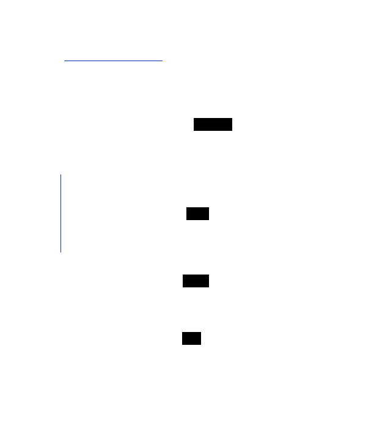

# Getting started

This page gives a high-level overview of what a walnats-based project looks like. It's ok if you have unanswered questions after reading it. Later pages will dive into more details. This documentation targets to be as clear and approachable as possible with the cost of repetition.

## Overview

Walnats is a Python library for writing *event-driven* services. Being event-driven means that when a service (*producer* or *publisher*) wants to run some job in the background, on schedule, or in another internal service, that service *emits* an *event*. The event tells other services that something happened in the system. Other services (*subscribers*) may have one or multiple *actors* that *listen* to events and *handle* them in some way.

For example, your project may have a "users" service that emits a "user-registered" event. And then "notifications" service may have a "send-email" actor that sends a welcome email to the newly registered user.

This decoupling is a very powerful idea that allows scaling services in a microservices architecture fast and independently. You may run multiple instances of the same actor, and walnats will make sure to evenly distribute the job among them. Or you can add a new actor (let's say, you now want to also send an SMS to the registered user) without changing a line of code in the service emitting the event.

## Components

A typical walnats-based service consists of a few parts, each having its own name and serving a distinct purpose:

1. A **schema** describes the type of data you want to send in the event. For example, it can be a pydantic model `User` that has fields `id: int` and `full_name: str`.
1. An **event** ({py:class}`walnats.Event`) connects the event (identified by a name that is unique across the system) to a schema. For example, we can say that `user-registered` event has a `User` schema of data. It allows us to ensure type safety for both the publisher and the subscriber.
1. A collection of **events** ({py:class}`walnats.Events`) is used to emit events.
1. A **handler** is a function that gets called when an event happens. It gets called with a message (a value of the schema type, the event payload) and can do inside anything it needs to do.
1. An **actor** ({py:class}`walnats.Actor`) connects a handler to an event. It makes sure to call the handler when an event occurs.
1. A collection of **actors** ({py:class}`walnats.Actors`) is used to listen to all relevant events.

Here is a little memo of how these things are related to each other:

If you encounter an unfamiliar term in this documentation, check out {doc}`glossary`. If the term is missed there, send a Pull Request.

## Before you start

If you like a hands-on approach and want to write your own project as you follow along, you need to prepare the environment first:

1. Install walnats: `python3 -m pip install walnats`
1. [Install nats server](https://docs.nats.io/running-a-nats-service/introduction/installation): `go install github.com/nats-io/nats-server/v2@latest`
1. Run nats server: `nats-server --jetstream`
